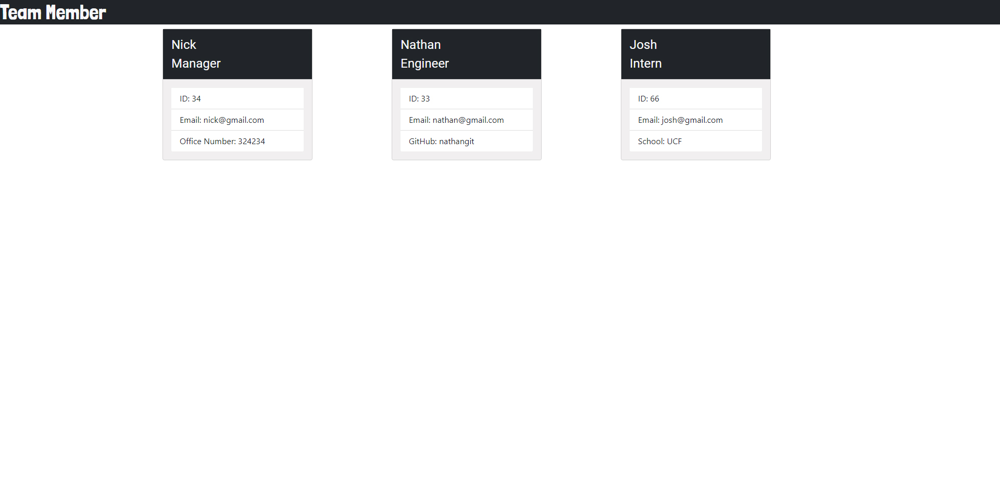

# Team_Generator
  
## Description
Team_generator is a CLI app that let's you build an html with information about your team. walkthrough video in the following link https://www.youtube.com/watch?v=uI8OeOh0uco
## Table of Contents 
* [Installation](#installation)
* [Usage](#usage)
* [ScreenShots](#screenshots)
* [Contributing](#contributing)
* [Tests](#tests)
* [Questions](#questions)
## Installation
To install necessary dependencies, run the following command:
```
npm i
```
## Usage
Just clone it and install dependencies

## Screeshots

## Tests
To run tests, run the following command:
```
npm test
```
## Questions
If you have any questions about the repo, open an issue or contact me directly at nicollas@gmail.com. 
You can find more of my work at [nickverneck](https://github.com/nickverneck/).

